# 使用方法 ※使用新启动器必读※ 

1. **下载完整合包**、或**下载补丁包并已经覆盖**到TOP根目录后，将tetris.exe和TOPLauncher.exe都设置为【**以管理员模式运行此程序**】

具体操作：右键——属性——兼容性选项卡——以管理员身份运行此程序

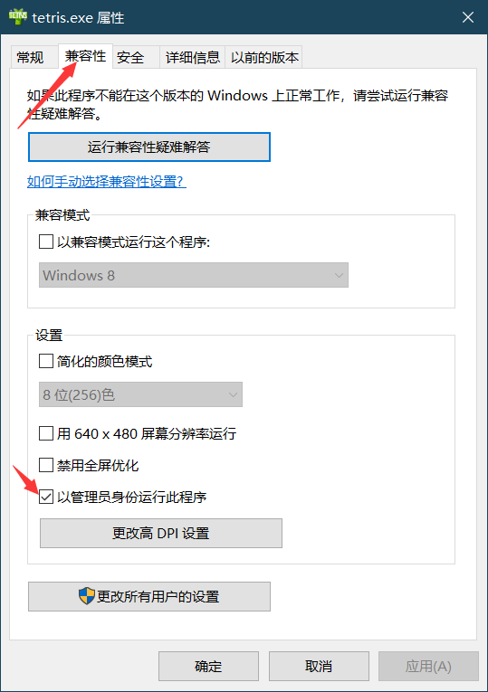 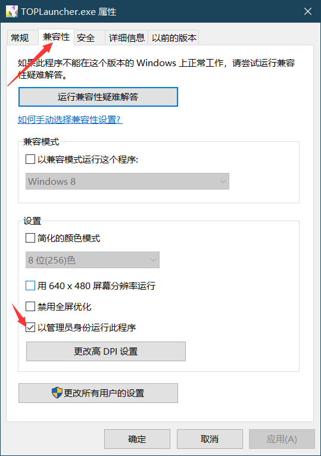

1. 打开【**TOPLauncher.exe**】（如果打开启动器报错则你需要安装C++运行库）

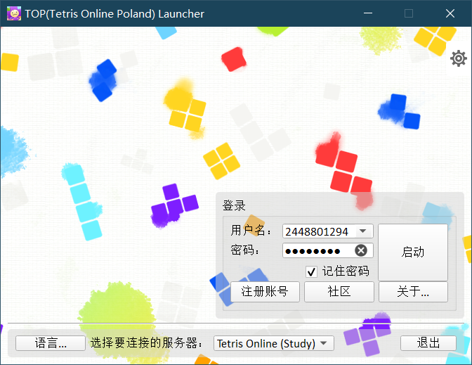

3. 此时点击【注册按钮】则会跳转到TOP的官网上注册，我们现在着手添加Tetris Online (Study)。

点击右上角的设置按钮，打开设置界面后，请将以下内容按照下图的位置填入，并点击 **【保存更改】**。

如果你已经有了 Tetris Online (Study) 的选项，请点击Tetris Online (Study)，并确认右侧内容一致后，点击 **【保存更改】**。

```
Tetris Online (Study)
teatube.cn
http://teatube.cn/tos/ 
```

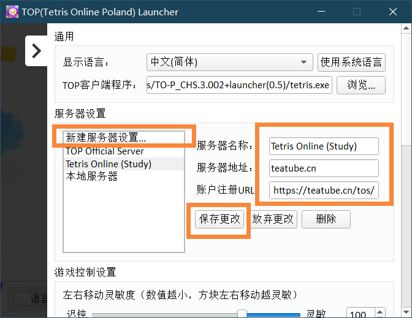

<br/>

下方可以调整游戏控制参数。请使用鼠标滚轮下滑，或拖动右侧滑条查看相关设置。

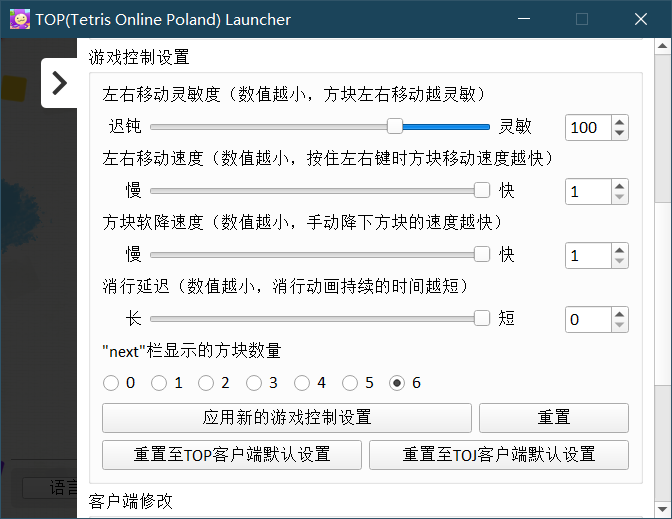

其中，**【消行延迟】**为**本启动器专有选项**，可以减小到0。

点击**【应用新的游戏控制设置】**可以保存相关选项。

4. 保存设置、回到主界面后，选择下方服务器为Tetris Online (Study)（或你自定义的名称）。

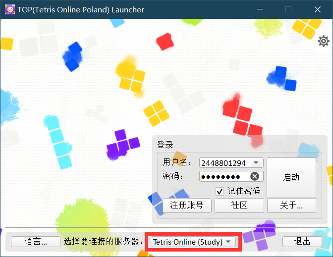

如果没有茶服账号，请参考**【注册账号】**章节获得账号。

5. 登录！

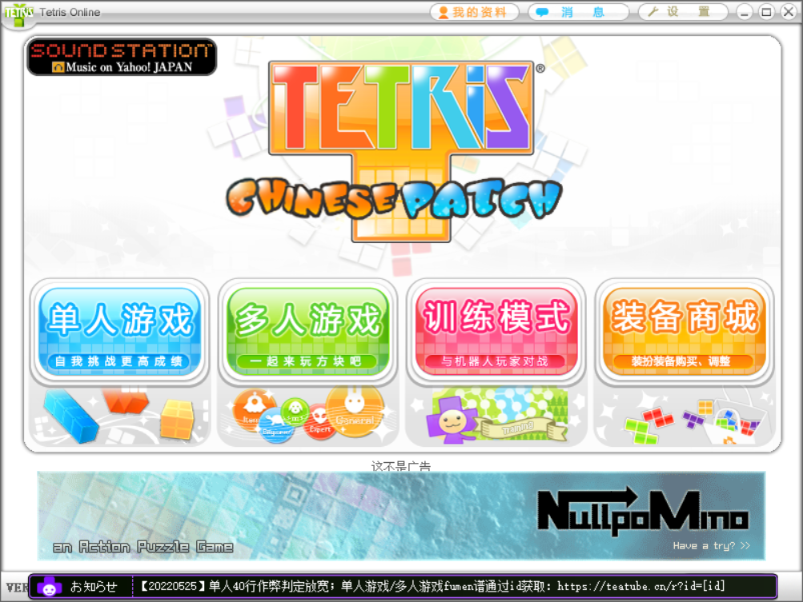

## 旧版启动器添加方法 ##

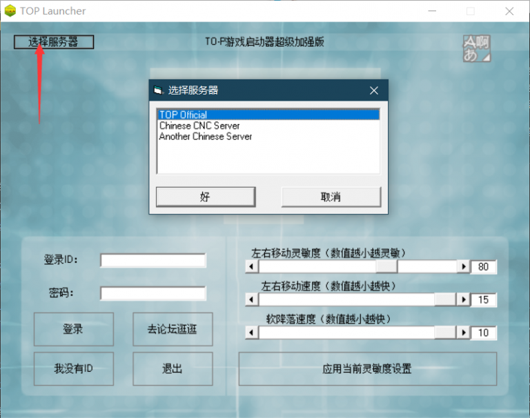

图片当中的选择服务器没有茶服，需要手动按照如下步骤添加：

1.找到 launcher 文件夹下的servers.txt文件

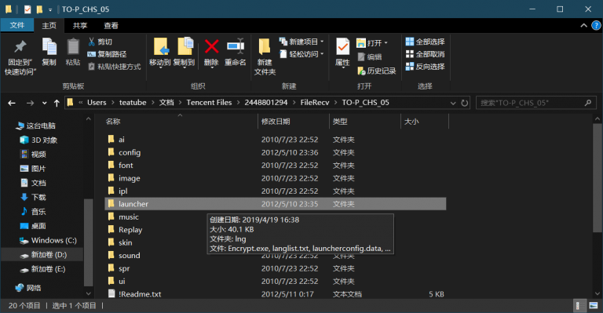

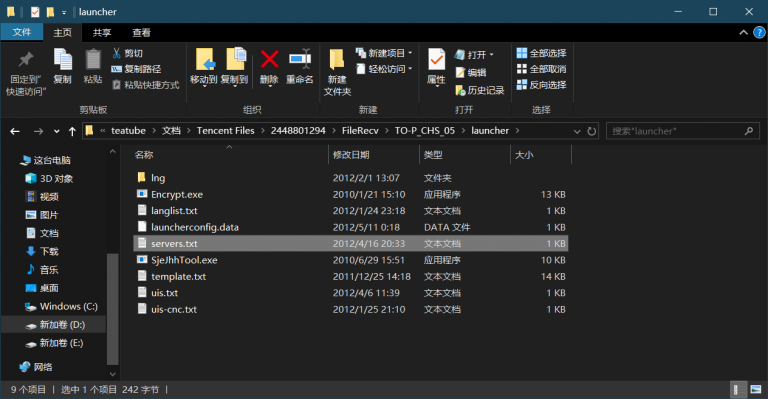

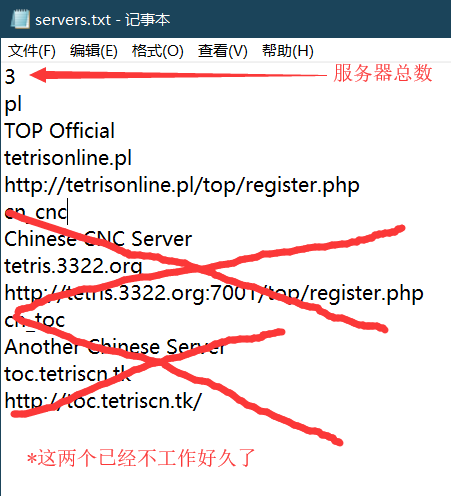

可以把servers.txt的更换为以下内容：

```
2
pl
TOP Official
tetrisonline.pl
http://tetrisonline.pl/top/register.php
TOS
Tetris Online (Study)
teatube.cn
http://teatube.cn/tos/
```

保存后，重启Launcher就会有Tetris Online (Study) 啦~

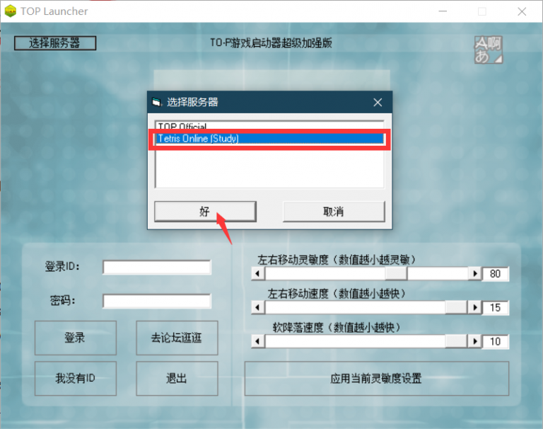
